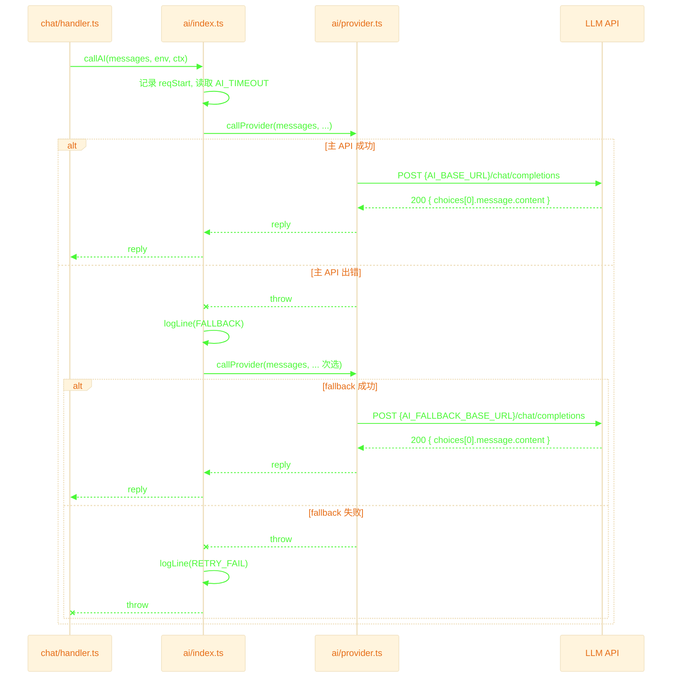

# AI Layer — AI 调用层

接收 chat handler 传入的完整 messages 数组，完成**双 provider 重试 → LLM API 调用 → 响应解析**，返回回复。

## 退出路径速查

| 触发条件 | 来源文件:行 | 返回方式 | 日志标记 |
|---------|------------|---------|---------|
| 主 API 超时 | `provider.ts:43-45` | 转 fallback | `TIMEOUT` |
| 主 API HTTP 错误 | `provider.ts:50-53` | 转 fallback | `ERROR` |
| 主 API 成功 | `provider.ts:56-59` | `200 { reply }` | `RESP` |
| fallback API 超时 | `provider.ts:43-45` | throw → handler 兜底 | `TIMEOUT` |
| fallback API HTTP 错误 | `provider.ts:50-53` | throw → handler 兜底 | `ERROR` |
| fallback API 成功 | `provider.ts:56-59` | `200 { reply }` | `RESP` |
| 全部失败 | `index.ts:30-46` | throw → handler 兜底 | `RETRY_FAIL` |
