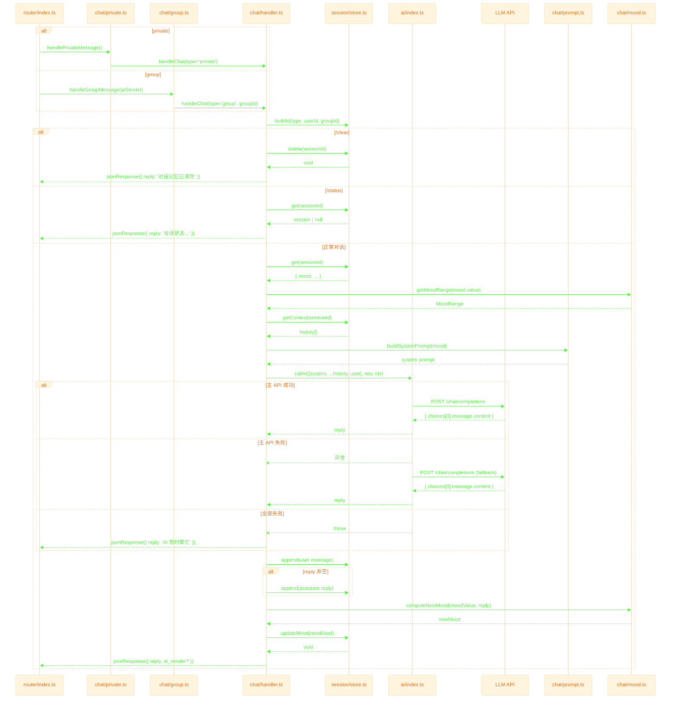

# Chat Layer — 对话层

接收 router 分发的消息，完成**命令处理 → 会话管理 → AI 调用 → mood 更新**，返回回复。

## 退出路径速查

| 触发条件 | 来源文件:行 | HTTP 返回 | 日志标记 |
|---------|------------|----------|---------|
| 私聊消息 | `private.ts:10` | 转 handler | `type=private` |
| 群聊 @机器人 | `group.ts:11` | 转 handler | `type=group` |
| 命令 `/clear` | `handler.ts:45` | `200 { reply }` | `CMD` |
| 命令 `/status` | `handler.ts:51` | `200 { reply }` | `CMD` |
| 主 API 成功 | `handler.ts:73` | `200 { reply }` | `END` |
| 主 API 失败 → fallback 成功 | `ai/index.ts:88-92` | `200 { reply }` | `FALLBACK` |
| 主 + fallback 均失败 | `ai/index.ts:102-104` | `200 { reply }` | `RETRY_FAIL` |
| 异常兜底 | `handler.ts:98` | `200 { reply: AI 暂时繁忙 }` | `ERROR` |
