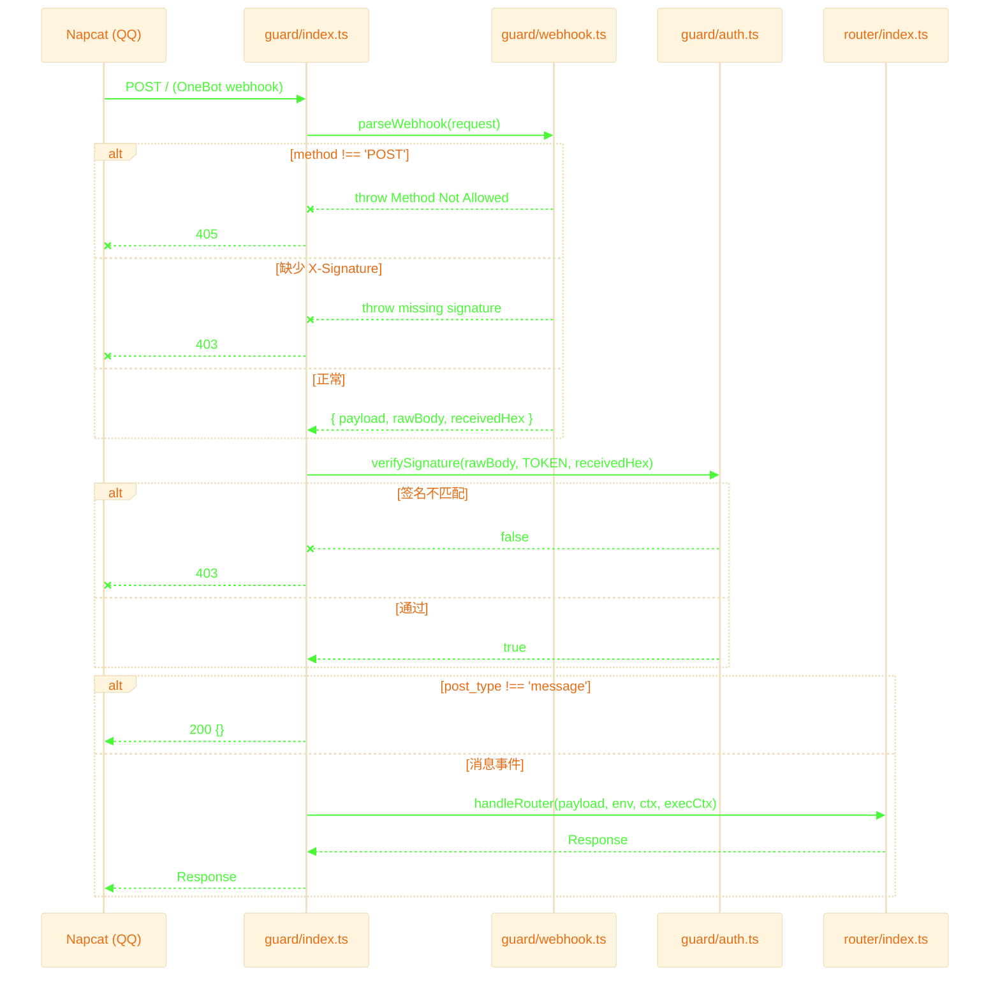

# Guard Layer — 请求守卫层

接收 Napcat OneBot webhook，完成**解析 → 鉴权 → 分发**三步，过滤无效请求后转 router。

## 退出路径速查

| 触发条件 | 来源文件:行 | HTTP 返回 | 日志标记 |
|---------|------------|----------|---------|
| 非 POST 方法 | `webhook.ts:12` | `405 Method Not Allowed` | `method=not-allowed` |
| 缺少 `X-Signature` | `webhook.ts:17` | `403 missing signature` | `signature=missing` |
| 签名不匹配 | `auth.ts:29` | `403 signature mismatch` | `signature=mismatch` |
| 非消息事件 | `index.ts:27` | `200 {}` | `post_type=xxx` |
| 异常兜底 | `index.ts:35` | `200 {}` | `error="xxx"` |
| ✅ 正常通过 | `index.ts:32` | 由 router 决定 | `status=200` |
