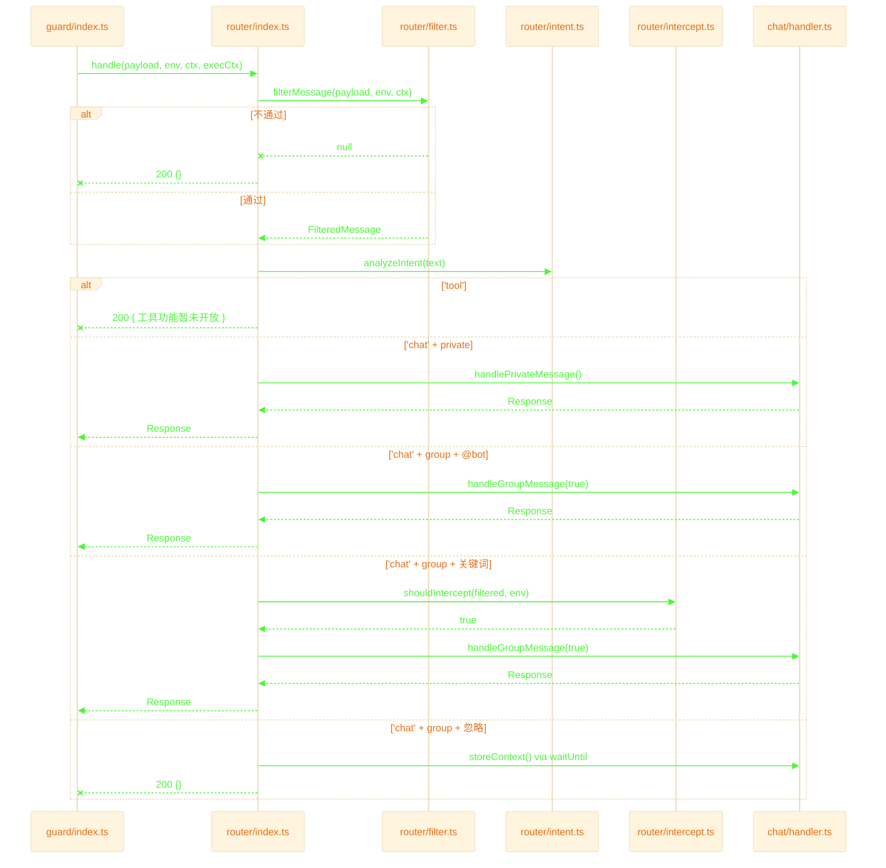

# Router Layer — 路由层

接收 guard 传入的消息，完成**过滤 → 意图识别 → 分发**，将有效消息投递到对应 chat handler。

## 退出路径速查

| 触发条件 | 来源文件:行 | HTTP 返回 | 日志标记 |
|---------|------------|----------|---------|
| 消息类型无效 / 空消息 / 群不在白名单 | `filter.ts:69-113` | `200 {}` | `IGNORE` |
| `/` 或 `#` 命令（除 clear/status） | `intent.ts:15` | `200 { reply }` | `intent=tool` |
| 私聊消息通过 | `filter.ts:90-98` | 转 private handler | `type=private` |
| 群聊 @机器人 | `filter.ts:115-125` | 转 group handler | `isAtBot=true` |
| 关键词拦截命中 | `intercept.ts:9` | 转 group handler | — |
| 群聊 + 无 @ + 无关键词 | `index.ts:44` | `200 {}` | `type=group` |
